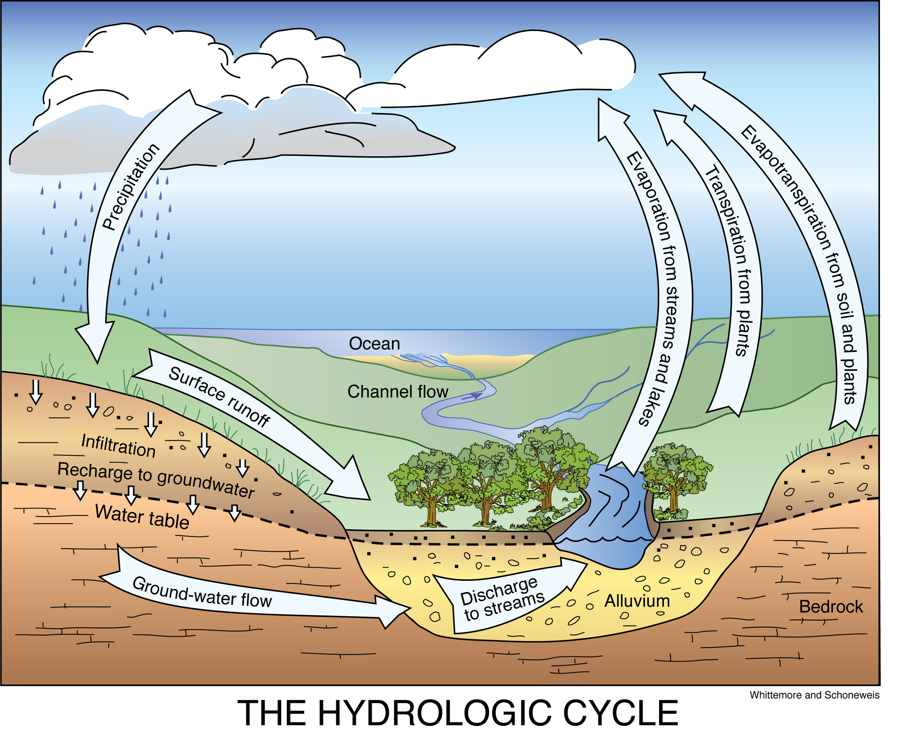
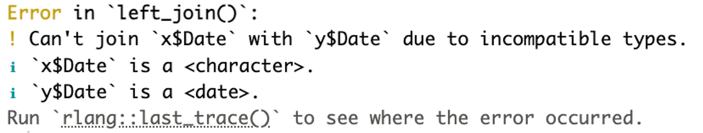

<div class="block"> 
	<center>
		
	</center>
</div>

<div style="text-align: center;">
  
</div> 

*Created by Holly Bacon* 
 
## Tutorial Aims:

1. Learn the importance of Rainfall-Runoff models, what they do and why we need them.
2. Understand how we decide model parameters.
3. Become confident in creating a Rainfall-Runoff model that can accurately predict flow values that match up with real values.

## Tutorial Steps:

#### <a href="#1"> 1. What is a Rainfall-Runoff Model?</a>

#### <a href="#a"> a) Why do we want to do this?</a>

#### <a href="#section2"> Part 2. Data preparationa</a>

#### <a href="#section2"> 2.1. Install packages and load data</a>


<a name="1"></a>
### 1. What is a Rainfall-Runoff model?

Welcome! Here, you're going to learn the basis of creating a Rainfall-Runoff model. But, you might be wondering... okay but what is a Rainfall-Runoff model? If you're not familiar with this, that's okay. Let's go over it:

Let's zoom right out and look at the Hydrological cycle. 

<div style="text-align: center;">
  
</div>

Here, we can see precipitation enters the system and either:
- runs straight to the channel (surface runoff),
- infiltrates into the ground
- or evapotranspires back up.

So.. what if we created a model that could predict the average flow of water through a river each month in any year. 

<a name="a"></a>
### a) Why do we want to do this?

Runoff models aim to successfully track changes in water availability, floods and droughts over time (Jehanzaib et al, 2022). 

For example, imagine you're a hydrologist studying a Scottish catchment. You have access to precipitation and daily flow data from 1970-now. Based on your understanding of the catchment characteristics - such as, soil type, topography, land cover, evapotranspiration - you can create a model that reflects the observed trends and patterns within this catchment. By adjusting parameters, such as infiltration rates, interception rates and surface runoff coefficients, you can fine-tune the model to mimic how the hydrological cycle behaves in the region.

At the end, the model will provide a predicted flow, which can be plotted against the observed daily flow to see how well your model performs. Do the lines match up? Did it capture seasonal trends? If the lines match up, this means you've successfully created a Rainfall-Runoff model that captures the hydrological dynamics of your catchment. 

Once validated, the model becomes a powerful resource. It can be used to predict future flow rates based on estimated precipitation levels, providing valuable insights for mitigating flood risks and improving water resource management. By simulating different scenarios, such as changes in land use or climate, hydrologists can use runoff models in decision-making and improve resilience to extreme climatic events.

> **_TIP:_**
If you don't have much experience with R, you should check out some of the Coding Club tutorials such as, "Intro to R" (https://ourcodingclub.github.io/tutorials/intro-to-r/) to get a grip of the basics. This tutorial will also incorparate various functions from the `dplyr` package, therefore the "Basic data manipulation" tutorial (https://ourcodingclub.github.io/tutorials/data-manip-intro/) will also be very useful if you've never used the `dplyr` package before.

<a name="2"></a>
### Part 2. Data preparation  

> **_TIP:_**
All the files you need to complete this tutorial can be downloaded from this <a href="https://github.com/EdDataScienceEES/tutorial-hollybee04.git" target="_blank" markdown="1">repository</a>. Click code, download the URL and paste in a new project in R Studio. 

Open a new script, write a title, your name, the date and load in the packages and data. Throughout this tutorial you can copy the code boxes into your own script. Remember # give extra context and explain what the code is doing! 

The UK Centre for Ecology and Hydrology (https://nrfa.ceh.ac.uk/data/search) collects precipitation and daily flow data across the whole of the UK, as well as detailed catchment info. For this tutorial, we're going to be using the Tweed at Peebles in Scotland. 

<a name="3"></a>
### 2.1 Install packages and load data
```r
# Tutorial: Understanding and Building a Rainfall-Runoff Model
# Written by ...
# Date 

---- Library ----

library(nasapower) # for downloading evapotranspiration data 
library(dplyr) # for data manipulation
library(ggplot2) # for data visualisation
library(lubridate) # for data handling

---- Load data ----

Flow <- read.csv("data/Daily_flow.csv")
Precipitation <- read.csv("data/Rainfall_Data.csv")

# Download Et data from NASA! (nasapower)

# Set coordinates for the Tweed catchment.

Latitude <- 55.647
Longitude <- -3.179

Evapotranspiration <- get_power(
  community = "AG", # AG = agriculture
  pars = "EVPTRNS",  # Evapotranspiration
  lonlat = c(longitude, latitude),
  temporal_api = "daily",
  dates = c("2015-01-01", "2017-12-31") # Data range. We are choosing to base the model on these 3 years but you could do different years or for a longer time. 
)

```

If you were to pick a different catchment, you would download data specific to that area, including latitude and longitude values. I found these on google maps by matching up roughly where the rain guage was on CEH.

### 2.1 Install packages and load data

```r
---- Data preparation ----

# Remove first 19 rows of metadata

Flow_clean <- Flow[20:nrow(Flow), ] # This excludes the first 19 rows and only rows 20 and on are kept in the new data frame "Flow_clean".

Precipitation_clean <- Precipitation[20:nrow(Precipitation), ]

# Name the new columns

colnames(Flow_clean) <- c("Date", "Daily_flow_m3pers") # CEH states the daily flow data is recorded in m3/s.

colnames(Precipitation_clean) <- c("Date", "Precipitation_mm")

# Select necessary columns

Flow_clean <- Flow_clean %>%
  select(Date, Daily_flow_m3pers )

Precipitation_clean <- Precipitation_clean %>%
  select(Date, Precipitation_mm )

Evapotranspiration_clean <- Evapotranspiration %>%
  select(YEAR, MM, DD, DOY, YYYYMMDD, EVPTRNS)

# Name Et columns 

colnames(Evapotranspiration_clean) <- c("Year", "MM", "DD", "DOY", "Date", "Et_mm")

Evapotranspiration_clean$MM <- month.abb[Evapotranspiration_clean$MM] # Change to names instead of numeric month values. "month.abb" = 3 letter abreviations for the months.

```

If you're confused what the pipes (`%>%`) are doing, head to the 'Efficient data manipulation' tutorial (https://ourcodingclub.github.io/tutorials/data-manip-efficient/) which introduces pipes. If you just need a quick reminder - pipes chain operations together in a more efficient and readable way! 

Great! Now we have all the data we need and it's pretty organised now. But it's all seperate. Lets combine the 3 datasets together using a cool `dplyr` function called `left_join` 

> **_TIP:_**
Why I love `left_join()`: 
It's really easy to use and allows you to combine data sets together, but specifically when you want to keep the rows from the left data frame and add matching values from the right data frame. Where values don't match, an NA will appear. This is useful when you have collected data on multiple different variables and so you have may have separate data frames.

```r
Merge 3 datasets ----

# First merge flow and precipitation data together by matching dates 

Merged_data <- Flow_clean %>%
left_join(Precipitation_clean, by = "Date")
# Merged_data now contains both flow and precipitation. Now lets join Et.

Final_merged_data <- Merged_data %>%
  left_join(Evapotranspiration_clean, by = "Date") # Doesn't work!

```

HANG ON! Notice when you try to join Et on an error appears:

<div style="text-align: center;">
  
</div>

This is because the date column in Flow and Precipitation (x$Date) is a character but the date column in Et is in 'date' form (use `str(Evapotranspiration_clean$Date)` if you don't believe me!). This means we need to change the date column in Et to a character!

```r
# Change Evapotranspiration_clean to a character to match with other data sets
Evapotranspiration_clean$Date <- as.character(Evapotranspiration_clean$Date)

# Try again!
Final_merged_data <- Merged_data %>%
  left_join(Evapotranspiration_clean, by = "Date")

```

You can also use this when you need to change a column to a factor or numeric: as.factor, as.numeric. 

OKAY! Now we have one big data set containing all the information we need. What's next?

Now we need to filter to the years we want to calibrate our model with (2015-2017). We can do this by using the `filter()` function which selects rows based on the conditions we set. 

```r
# Filter to 2015-2017 ----

# Filter for dates within the range
Filtered_data <- Final_merged_data %>% 
  filter(Date >= as.Date("2015-01-01") & Date <= as.Date("2017-12-31"))

```

- Condition 1: "Date >= as.Date("2015-01-01")" keeps rows where the Date column is greater than or equal to January 1st 2015. "as.Date" ensures date is treated as a date and not just text.
- Condition 2: "Date <= as.Date("2017-12-31")" keeps rows where the Date column is less than or equal to December 31st 2017.

Now we have our dataset with all the information we need AND filtered to the right timeline. The next step is to ensure we have the correct units. In hydrological modelling we often use m to maintain consistency with other variables (such as flow). We can leave Et as it is as we are only going to be visualising Et trends to help us decide one of the parameters. 

Remember before we changed the 'date' column to a character to merge two data sets. Well, now we're dealing with numbers and maths, we need to change precipitation from a character to a numeric value! Luckily, we already know how to do this. Once we've converted it, we then need to add up all the daily precipitation values for each month as we only really want one value per month telling us.. okay there was this amount of rain in January or there was this amount of rain in March. The same for flow too!

```r
# Fix units ----

# Precipitation conversion
# mm ----> m
# Divide by 1000. 

str(Filtered_data$Precipitation_m) # Character

# Change to numeric
Filtered_data$Precipitation_mm <- as.numeric(Filtered_data$Precipitation_mm) 

# Create a new column with the precipitation in metres.
Filtered_data$Precipitation_m <- Filtered_data$Precipitation_mm / 1000

# Now we only want one precipitation value each month, so we need to sum each month up:
Filtered_data <- Filtered_data %>%
  group_by(Year, MM) %>% # Group by year and month so it knows to sum up jan of 2015, feb of 2015..., jan of 2016 and so on. 
  mutate(Monthly_precipitation_m = sum(Precipitation_m)) # Create a new column containing monthly precipitation. 

# Daily flow luckily came in the correct units = m3/s (cubic metres per second)
# But, like precipitation, we only want one summed flow value for the whole month!
# So lets first get each discharge per day instead of per secs then add up all the days to get a sum of the month!

# Remember to change Daily flow m3/s to numeric NOT character. 
Filtered_data$Daily_flow_m3pers <- as.numeric(Filtered_data$Daily_flow_m3pers)

# Times each Daily flow by the number of seconds in a day (86400) then by days in the month. 
Filtered_data <- Filtered_data %>%
  group_by(Year, DD) %>% # DD = day, because we're focus on individual days here. 
  mutate(Daily_flow_m3 = Daily_flow_m3pers * 86400) %>%
  ungroup() %>% 
  group_by(Year, MM) %>% # Now we're focusing on months to get the monthly flow. 
  mutate(Monthly_flow_m3 = sum(Daily_flow_m3)) %>%
  ungroup()
```

> **_TIP:_**
ALWAYS remember to `ungroup()` after you're done with that operation to make sure operations later on are not affected by certain columns being grouped together.

# 4 ---- OBSERVED VALUES ----

# Lets calculate these, to get a jist of what were aiming for. 

Data <- Data %>%
  group_by(Year, MM) %>%  # Group by both Year and Month
  mutate(Observed_flow = Monthly_flow_m3 / (31*24*60*60)) %>%
  ungroup()

# 5 ---- PARAMETERS ----


# 5.1 Loss term 1 (L1) ----

# L1 = Amount of water that reaches the surface AFTER interception, AFTER evapotranspiration!!! 
# 0.2 means 20% of water reaches the surface. 
# 0.6 means 60% of water reaches the surface.

# But hang on, its gonna differ seasonally. 
# Lets look at Et levels throughout the years 
# Set Month and year to a factor with the correct order
Filtered_data <- Filtered_data %>%
  mutate(
    MM = factor(
      MM,
      levels = month.abb  # Levels set to the correct order (Jan, Feb, ..., Dec)
    ),
    Year = as.factor(Year)
  )
  
ggplot(Data, aes(x = MM, y = Et_mm, color = Year, group = Year)) + 
  geom_point() +
  labs(title = "Et Levels 2015-2017", 
       x = "Month", 
       y = "Evapotranspiration (mm)") +
  theme_minimal() +
  theme(axis.text.x = element_text(angle = 45, hjust = 1))

# Nov-March low-none Et
# March, Apr and Oct mid Et
# Summer aka May-Aug VVV high!

# So what does this mean?
# More evapotranspiration = less rainfall reaching the ground. 

# Now, think about interception.

# For this look at vegetation cover over the catchment on CEH. Is it mostly urban? rural? woodland? agriculture? 
# CEH: Mostly grassland and mountain/heath/bog. With a little amount of arable and woodland and very very small section of built-up areas.

# These 2 factors (Et and interception) help us decide a loss parameter for the model called L1. 

# Based on the Et graph, we may choose to separate into seasons. 

# So Nov-March = Little Et, little interception by urban/woodland therefore we may expect a large amount of rainfall to reach the surface. 

# 0.8 = 80% of rainfall reaches the surface. 20% is either intercepted or evapotranspirated.

# As for the other months, April-May and Aug-Oct with mid Et, a parameter of 0.5 may make more sense

# And for June to July with v v v high Et, a parameter of 0.2 makes sense. 

# 5.2 Surface to Channel (C1) ----

# Topography, soil type - permeable, impermeable? 

# Low permeability 
# UPLAND = STEEP = FAST RUNOFF
# However, it does have floodplains which can store water in flood events, reducing runoff.
# But generally, we would expect this number to be high. 
# C1 + C2 CANT EQUAL 1 OR MORE THAN 1 = STORAGE IS EMPTY

# 0.6 = 60% of water goes straight to channel.

# 5.3 Surface to ground (C2) ----

# Low permeability

# 0.3

# 5.4 Ground to channel (C3) ----

# 0.55

# 5.5 Loss term 2 (L2) ----

# How much leakage occurs? 

# This is hard, you may have to research for this.

# But lets just say 20% for now. 

# 6 ---- BUILDING THE MODEL ----

# Aggregate daily data into monthly data so we only have 1 row each month
Monthly_data <- Data %>%
  group_by(Year, MM) %>% # Group by Year and Month
  summarize(
    # Retain the first value for columns that don't vary within the month
    Monthly_precipitation_m = first(Monthly_precipitation_m),
    Observed_flow = first(Observed_flow),
    .groups = "drop" # Ungroup after summarizing
  )

# Create columns of each stage in the model
Rainfall_Runoff_Model <- Monthly_data %>%
  mutate(
    Area = 694,
    Initial_surface_storage = 0,
    Initial_ground_storage = 0,
    C1 = 0.6,
    C2 = 0.3,
    C3 = 0.55,
    L2 = 0.2,
    Surface_storage = NA,
    Ground_storage = NA,
    Surface_to_channel = NA,
    Surface_to_ground = NA,
    Ground_to_channel = NA,
    Pred_channel_input = NA,
    Pred_mean_channel_discharge = NA
  )

# Iterate over months in the data
for (i in 1:nrow(Rainfall_Runoff_Model)) {
  
  # Extract the current row
  current_month <- Rainfall_Runoff_Model[i, ]
  
  # Calculate total water input
  Total_water_input <- current_month$Monthly_precipitation_m * current_month$Area * 1000000
  
  # Calculate surface storage
  Surface_storage <- current_month$Initial_surface_storage + 0.8 * Total_water_input
  
  # Calculate surface to channel and surface to ground
  Surface_to_channel <- current_month$C1 * Surface_storage
  Surface_to_ground <- current_month$C2 * Surface_storage
  
  # Calculate ground storage
  Ground_storage <- current_month$Initial_ground_storage + current_month$L2 + Surface_to_ground
  
  # Calculate ground to channel
  Ground_to_channel <- current_month$C3 * Ground_storage
  
  # Predicted channel input
  Pred_channel_input <- Surface_to_channel + Ground_to_channel
  
  # Predicted mean channel discharge
  Pred_mean_channel_discharge <- Pred_channel_input / (31 * 24 * 60 * 60)  # Assuming all months have 31 days
  
  # Update the values in the dataset
  Rainfall_Runoff_Model$Surface_storage[i] <- Surface_storage
  Rainfall_Runoff_Model$Ground_storage[i] <- Ground_storage
  Rainfall_Runoff_Model$Surface_to_channel[i] <- Surface_to_channel
  Rainfall_Runoff_Model$Surface_to_ground[i] <- Surface_to_ground
  Rainfall_Runoff_Model$Ground_to_channel[i] <- Ground_to_channel
  Rainfall_Runoff_Model$Pred_channel_input[i] <- Pred_channel_input
  Rainfall_Runoff_Model$Pred_mean_channel_discharge[i] <- Pred_mean_channel_discharge
  
  # Update initial values for the next month, if it exists
  if (i < nrow(Rainfall_Runoff_Model)) {
    Rainfall_Runoff_Model$Initial_surface_storage[i + 1] <- Surface_storage * (1 - current_month$C1 - current_month$C2)
    Rainfall_Runoff_Model$Initial_ground_storage[i + 1] <- Ground_storage - Ground_to_channel
  }
}

# 8 ---- Time to compare ----

# Assuming 'Rainfall_Runoff_Model' has columns: Date, Rainfall, Runoff

Rainfall_Runoff_Model <- Rainfall_Runoff_Model %>%
  # Create a 'Date' column with first day of each month
  mutate(Date = seq(ymd("2015-01-01"), by = "month", length.out = nrow(Rainfall_Runoff_Model)))

# PLOT!!!!!
ggplot(Rainfall_Runoff_Model, aes(x = Date)) +
  geom_line(aes(y = Pred_mean_channel_discharge, color = "Predicted mean channel discharge"), size = 1) +
  geom_line(aes(y = Observed_flow, color = "Observed flow"), size = 1, linetype = "dashed") +
  labs(
    title = "Rainfall and Runoff Over Time",
    x = "Date",
    y = "Flow (m³)",
    color = "Legend"
  ) +
  scale_color_manual(values = c("Predicted mean channel discharge" = "blue", "Observed flow" = "red")) +
  theme_minimal()

# YAYYY


The parameters are decided based on typical characteristics of your chosen catchment (In this tutorial, we'll be looking at the Tweed at Peebles catchment). Characteristics include:
- Topography - is your catchment pretty flat, steep hills, undulating terrain?
- Soil type - permeable/impermeable? This affects how well precipitation infiltrates into the soil.
- Evapotranspiration (Et) - More Et in summer means less precipitation reaching the surface, therefore less surface runoff.
- Land cover - Woodland? Agriculture? Urban? Woodland = Higher interception, Higher Et? Urban = impermeable roads and pavements = more surface runoff.

These are all factors you have to think about when deciding parameters. 
                   
<center></center>

To add images, replace `tutheaderbl1.png` with the file name of any image you upload to your GitHub repository.

### Tutorial Aims

#### <a href="#section1"> 1. The first section</a>

#### <a href="#section2"> 2. The second section</a>

#### <a href="#section3"> 3. The third section</a>

You can read this text, then delete it and replace it with your text about your tutorial: what are the aims, what code do you need to achieve them?
---------------------------
We are using `<a href="#section_number">text</a>` to create anchors within our text. For example, when you click on section one, the page will automatically go to where you have put `<a name="section_number"></a>`.

To create subheadings, you can use `#`, e.g. `# Subheading 1` creates a subheading with a large font size. The more hashtags you add, the smaller the text becomes. If you want to make text bold, you can surround it with `__text__`, which creates __text__. For italics, use only one understore around the text, e.g. `_text_`, _text_.

# Subheading 1
## Subheading 2
### Subheading 3

This is some introductory text for your tutorial. Explain the skills that will be learned and why they are important. Set the tutorial in context.

You can get all of the resources for this tutorial from <a href="https://github.com/ourcodingclub/CC-EAB-tut-ideas" target="_blank">this GitHub repository</a>. Clone and download the repo as a zip file, then unzip it.

<a name="section1"></a>

## 1. The first section


At the beginning of your tutorial you can ask people to open `RStudio`, create a new script by clicking on `File/ New File/ R Script` set the working directory and load some packages, for example `ggplot2` and `dplyr`. You can surround package names, functions, actions ("File/ New...") and small chunks of code with backticks, which defines them as inline code blocks and makes them stand out among the text, e.g. `ggplot2`.

When you have a larger chunk of code, you can paste the whole code in the `Markdown` document and add three backticks on the line before the code chunks starts and on the line after the code chunks ends. After the three backticks that go before your code chunk starts, you can specify in which language the code is written, in our case `R`.

To find the backticks on your keyboard, look towards the top left corner on a Windows computer, perhaps just above `Tab` and before the number one key. On a Mac, look around the left `Shift` key. You can also just copy the backticks from below.

```r
# Set the working directory
setwd("your_filepath")

# Load packages
library(ggplot2)
library(dplyr)
```

<a name="section2"></a>

## 2. The second section

You can add more text and code, e.g.

```r
# Create fake data
x_dat <- rnorm(n = 100, mean = 5, sd = 2)  # x data
y_dat <- rnorm(n = 100, mean = 10, sd = 0.2)  # y data
xy <- data.frame(x_dat, y_dat)  # combine into data frame
```

Here you can add some more text if you wish.

```r
xy_fil <- xy %>%  # Create object with the contents of `xy`
	filter(x_dat < 7.5)  # Keep rows where `x_dat` is less than 7.5
```

And finally, plot the data:

```r
ggplot(data = xy_fil, aes(x = x_dat, y = y_dat)) +  # Select the data to use
	geom_point() +  # Draw scatter points
	geom_smooth(method = "loess")  # Draw a loess curve
```

At this point it would be a good idea to include an image of what the plot is meant to look like so students can check they've done it right. Replace `IMAGE_NAME.png` with your own image file:

<center>  </center>

<a name="section1"></a>

## 3. The third section

More text, code and images.

This is the end of the tutorial. Summarise what the student has learned, possibly even with a list of learning outcomes. In this tutorial we learned:

##### - how to generate fake bivariate data
##### - how to create a scatterplot in ggplot2
##### - some of the different plot methods in ggplot2

We can also provide some useful links, include a contact form and a way to send feedback.

For more on `ggplot2`, read the official <a href="https://www.rstudio.com/wp-content/uploads/2015/03/ggplot2-cheatsheet.pdf" target="_blank">ggplot2 cheatsheet</a>.

Everything below this is footer material - text and links that appears at the end of all of your tutorials.

<hr>
<hr>

#### Check out our <a href="https://ourcodingclub.github.io/links/" target="_blank">Useful links</a> page where you can find loads of guides and cheatsheets.

#### If you have any questions about completing this tutorial, please contact us on ourcodingclub@gmail.com

#### <a href="INSERT_SURVEY_LINK" target="_blank">We would love to hear your feedback on the tutorial, whether you did it in the classroom or online!</a>

<ul class="social-icons">
	<li>
		<h3>
			<a href="https://twitter.com/our_codingclub" target="_blank">&nbsp;Follow our coding adventures on Twitter! <i class="fa fa-twitter"></i></a>
		</h3>
	</li>
</ul>

### &nbsp;&nbsp;Subscribe to our mailing list:
<div class="container">
	<div class="block">
        <!-- subscribe form start -->
		<div class="form-group">
			<form action="https://getsimpleform.com/messages?form_api_token=de1ba2f2f947822946fb6e835437ec78" method="post">
			<div class="form-group">
				<input type='text' class="form-control" name='Email' placeholder="Email" required/>
			</div>
			<div>
                        	<button class="btn btn-default" type='submit'>Subscribe</button>
                    	</div>
                	</form>
		</div>
	</div>
</div>
